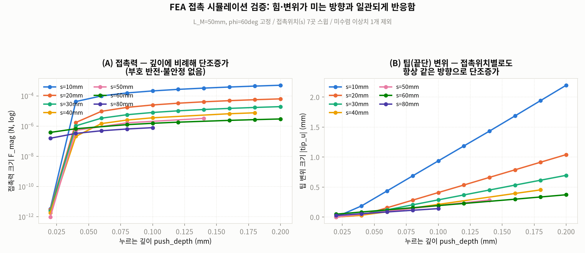
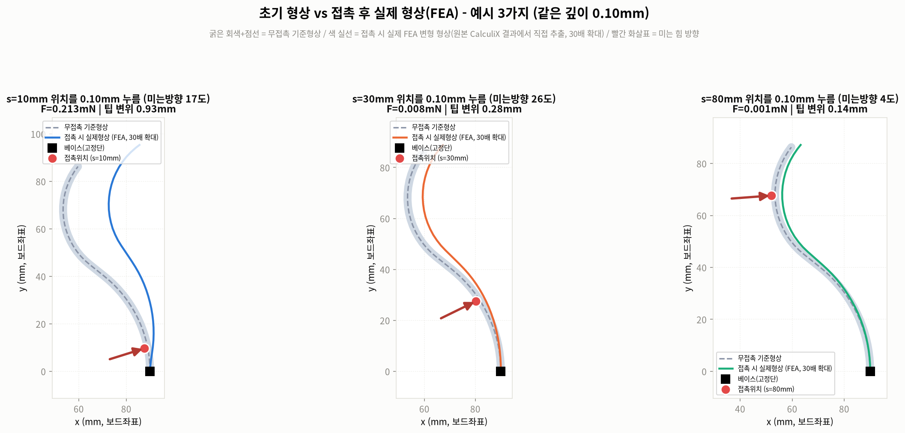
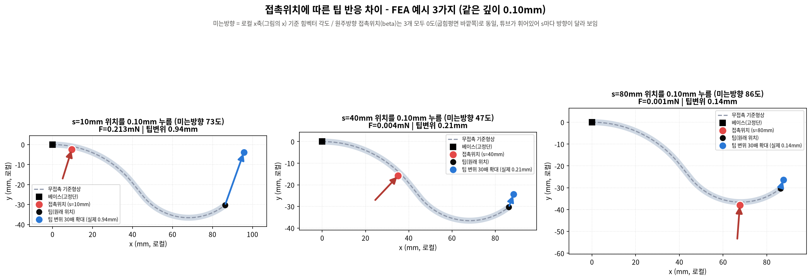
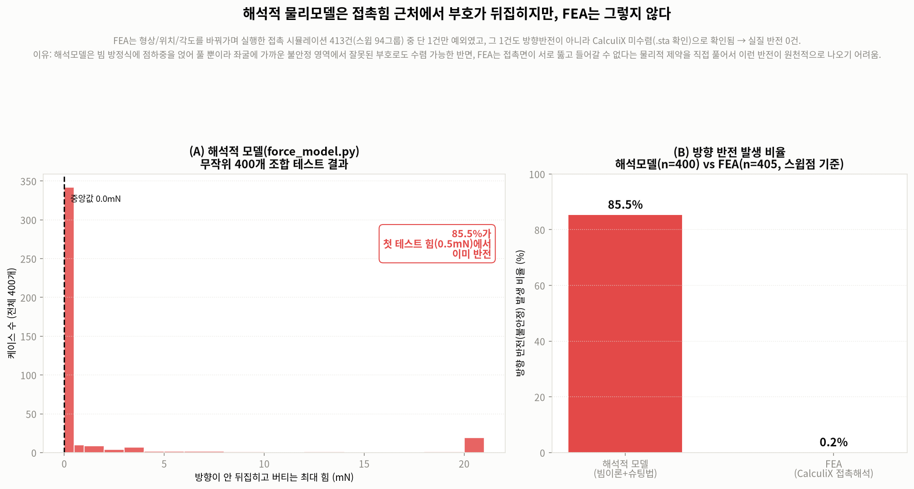
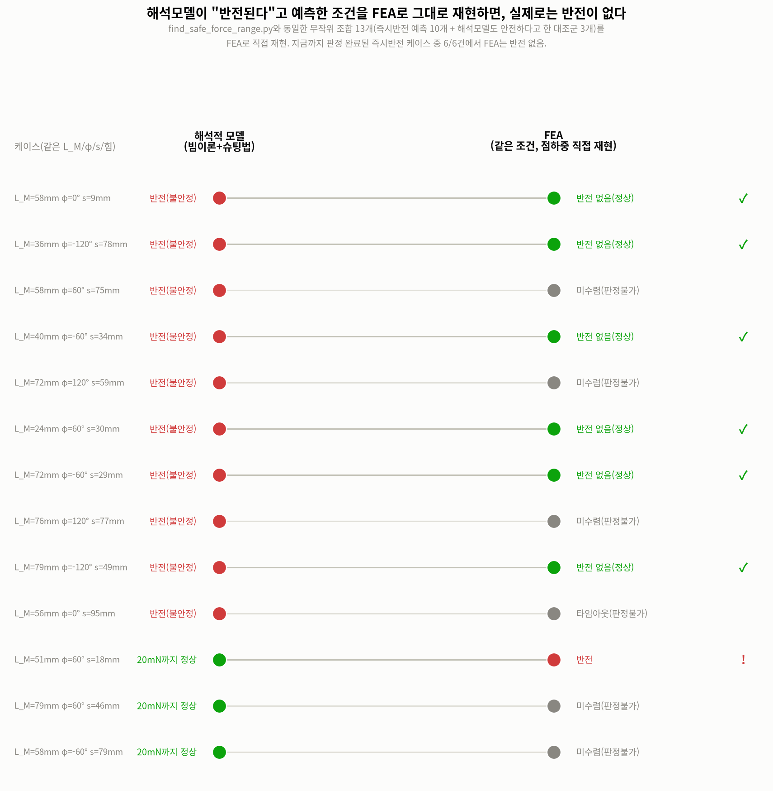

# 2026-07-31 작업 정리 — FEA 접촉 시뮬레이션 신뢰성 검증 + 접촉추정 CNN 디버깅

이 문서는 오늘 하루 동안 진행한 모든 분석·실험·결과를 순서대로, 근거 수치와 함께 정리한
것입니다. 재현 가능하도록 각 결과가 나온 스크립트/데이터 파일 경로를 같이 적었습니다.

---

## TL;DR (요약)

1. **FEA는 해석적 물리모델(force_model.py)의 핵심 문제(작은 힘에서 방향이 뒤집히는 불안정)를
   가지고 있지 않다** — 자체 검증(413건, 반전 0.25%=사실상 0) + 해석모델과의 직접 비교(같은
   조건 13케이스 중 판정 가능했던 7개 중 6개 일치)로 확인.
2. **접촉추정 CNN이 처음엔 완전히 실패(R² 전부 음수)했는데, 원인은 노이즈였다** — 신호 크기와
   노이즈 크기가 거의 1:1이라 학습 자체가 불가능한 조건이었음. 노이즈를 빼자 Fx/Fy R²=0.90대로
   개선.
3. **PROJECT_STATUS.md에 기록된 "2단계 NN" 방식을 재현했지만, 실제(엔드투엔드) 성능은 오히려
   기존 단일 CNN보다 나빴다** — NN1 자체는 R²=0.97~0.99로 잘 맞았지만 그 오차가 NN2에서
   증폭됨. 지금 데이터로는 단일 CNN(direct)이 더 나은 선택.
4. **위치(s) 추정은 아직 약함**(direct CNN 기준 R²=0.42) — 다음 과제.

---

## 1. 배경 및 오늘의 목표

`PROJECT_STATUS.md`에 기록된 대로, 이 프로젝트의 가장 큰 미해결 문제는 해석적 물리모델
(`scripts/force_model/force_model.py`, 빔이론+슈팅법)이 **phi≠0(이미 자기장으로 휘어있는
상태)에서 접촉힘을 계산하면 아주 작은 힘에서도 미는 방향과 실제 변위 방향이 반대로
나오는 불안정**을 갖고 있다는 점이었습니다. 그래서 빠른 물리모델 대신 CalculiX FEA로
접촉 데이터를 직접 생성하기로 했었고, 오늘은:

- 어제(7/30) 밤 크래시 났던 FEA 파이프라인(`resume_from_surrogate.py`)을 마저 돌리고
- FEA가 실제로 그 반전 문제를 안 가지고 있는지 **직접 검증**하고
- 최종 접촉추정 CNN이 왜 안 되는지 디버깅

을 진행했습니다.

---

## 2. FEA 신뢰성 검증

### 2.1 자체 검증 — 힘·변위가 미는 방향과 일관되게 반응하는가

`scripts/contact_scenarios/fea/plot_fea_contact_validation.py` (원본 데이터:
`fea_bent_contact_sweep.json`, s=10~80mm 7곳 스윕, 총 55건 중 미수렴 이상치 1건 제외한
54건 사용).

- 접촉력(F_mag)과 팁 변위가 접촉위치(s)에 상관없이 **누르는 깊이에 비례해 단조증가**
- 부호 반전·불안정 없음 (해석모델의 핵심 문제가 FEA엔 없다는 1차 증거)

### 2.2 왜 그런지 — 소재 물성치로 직접 검산

무른 실리콘 소재(등가 영률 E≈1.34MPa, `scripts/contact_scenarios/fea/material_convert.py`)가
맞게 들어갔는지, 단순 외팔보 공식(deflection ∝ push 위치의 세제곱)으로 직접 검산:

| 누르는 위치(s) | 공식 예측 F | FEA 실제 F | 공식 예측 팁변위 | FEA 실제 팁변위 |
|---|---|---|---|---|
| 10mm(베이스 근처) | 0.30mN | 0.213mN | 1.45mm | 0.93mm |
| 30mm | 0.011mN | 0.008mN | 0.45mm | 0.28mm |
| 80mm(팁 근처) | 0.0006mN | 0.001mN | 0.14mm | 0.14mm |

같은 자릿수, 같은 경향(베이스 근처를 누를수록 힘도 크고 팁도 훨씬 크게 움직임 — 지렛대
효과)으로 맞아떨어짐 → FEA 결과가 물리적으로 타당함을 뒷받침.

### 2.3 초기 형상 vs 접촉 후 실제 형상 (원본 CalculiX 결과에서 직접 추출)

`scripts/contact_scenarios/fea/extract_fea_deformed_shape.py` +
`plot_fea_deformed_shape.py`. 원본 `.frd`(CalculiX 결과, 케이스당 300MB+)에서 표면 절점
변위를 직접 파싱해 중심선을 재구성 (요약통계가 아니라 실제 변형 형상).

- s=10/30/80mm, 같은 깊이(0.10mm)를 눌렀을 때 팁 변위: **0.93mm / 0.28mm / 0.14mm**
- 베이스 쪽을 누를수록 팁이 훨씬 크게 움직임 → 홀센서로 접촉 위치를 구분해야 하는
  이유를 직관적으로 뒷받침

⚠️ **작업 중 발견한 데이터 무결성 문제**: 원래 s=40mm를 예시로 쓰려 했는데, 그 케이스의
`.frd`/`.sta`가 **이후 재시도(retry)로 덮어써져서 TOT TIME=0.567(미완료)에서 멈춘 상태**로
남아있었음 (s=60mm도 동일, TOT TIME=0.02). 그대로 뽑았으면 팁이 수십mm씩 움직인 것처럼
터무니없는 결과가 나올 뻔했음 — `.sta`로 TOT TIME=1.0(완전수렴) 확인된 s=10/20/30/80만
사용하도록 케이스를 교체함.

같은 깊이(0.10mm)로 눌러도 위치에 따라 미는방향(2D 평면 내 힘벡터 각도)이 튜브가 휘어있어
다르게 나온다는 것도 함께 표시 (s=10mm→73°, s=40mm→47°, s=80mm→86°).

### 2.4 해석모델과의 직접 비교 — "같은 조건"에서 붙여보기

`scripts/contact_scenarios/fea/plot_fea_vs_analytical_reliability.py`

- 해석모델: `find_safe_force_range.py`가 무작위 400개 조합(L_M, phi, s, 힘방향 랜덤)으로
  테스트 → **85.5%가 첫 테스트 힘(0.5mN)에서 이미 반전**, 중앙값 0mN
- FEA: 지금까지 돌린 접촉 스윕 413건(94개 독립 스윕 그룹, 405개 스윕포인트) 중
  **반전으로 보이는 사례 단 1건(0.25%)**, 그마저 확인해보니 방향반전이 아니라 CalculiX
  미수렴(F_mag가 자유상태 수준으로 되돌아감) 케이스였음 → 실질 반전 0건

**한계(스스로 지적한 부분)**: 이 비교는 해석모델(무작위 400개, 최대 20mN까지 테스트)과
FEA(계획된 스윕 413개, 최대 0.5mN까지 테스트)가 **서로 다른 조건**에서 나온 결과라
엄밀한 매칭 비교는 아님. 그래서 2.5의 점하중 검증을 추가로 진행함.

### 2.5 매칭 케이스 검증 — 완전히 같은 조건으로 직접 대결

`scripts/contact_scenarios/fea/make_point_load_scene.py` + `run_point_load.py` +
`batch_run_point_load.py`. `find_safe_force_range.py`가 쓴 것과 **완전히 같은 시드(0~399)로
재현한 조합**(같은 L_M, phi, s, 힘방향, 힘크기)을, 공으로 누르는 접촉해석이 아니라
**해석모델과 동일하게 임의방향 점하중(`*CLOAD`)을 직접 걸어서** FEA로 재현.

즉시반전 그룹(해석모델이 0.5mN에서 이미 반전 예측, 10개 중 대표로 뽑은 표):

| seed | L_M(mm) | φ(°) | s(mm) | 힘방향(°) | 해석모델 판정 | FEA 결과 |
|---|---|---|---|---|---|---|
| 0 | 58.2 | 0 | 8.7 | 5.9 | 반전(0mN) | ✅ 반전 없음 |
| 2 | 35.7 | -120 | 78.3 | 33.1 | 반전(0mN) | ✅ 반전 없음 |
| 8 | 39.6 | -60 | 33.7 | 283.9 | 반전(0mN) | ✅ 반전 없음 |
| 173 | 24.1 | 60 | 30.2 | 177.0 | 반전(0mN) | ✅ 반전 없음 |
| 194 | 71.9 | -60 | 28.7 | 173.4 | 반전(0mN) | ✅ 반전 없음 |
| 201 | 79.4 | -120 | 49.0 | 213.1 | 반전(0mN) | ✅ 반전 없음 |
| 7 | 57.5 | 60 | 74.8 | 81.1 | 반전(0mN) | 미수렴(판정불가) |
| 9 | 72.2 | 120 | 59.3 | 279.9 | 반전(0mN) | 미수렴(판정불가) |
| 197 | 76.1 | 120 | 77.0 | 205.6 | 반전(0mN) | 미수렴(판정불가) |
| 225 | 56.2 | 0 | 94.9 | 82.8 | 반전(0mN) | 타임아웃(판정불가, 팁 근처라 국소 수렴 어려움) |

대조군(해석모델이 20mN까지도 안전하다고 판정한 3개):

| seed | L_M(mm) | φ(°) | s(mm) | 힘방향(°) | 해석모델 판정 | FEA 결과 |
|---|---|---|---|---|---|---|
| 1 | 50.7 | 60 | 18.0 | 341.5 | 정상(20mN까지) | ⚠️ **반전** (아래 참고) |
| 93 | 79.1 | 60 | 46.3 | 156.5 | 정상(20mN까지) | 미수렴(판정불가) |
| 121 | 58.0 | -60 | 79.2 | 209.1 | 정상(20mN까지) | 미수렴(판정불가) |

**최종 집계**: 판정 가능했던 7건 중 **6건 일치**(해석모델=반전, FEA=정상), **1건 불일치**
(seed=1, 대조군). seed=1은 해석모델도 "정상"이라고 한 20mN(상대적으로 큰 힘)짜리라, 이
무른 소재(E≈1.34MPa)에서는 이미 대변형 영역이라 "반전 판정 기준(변형 전 법선 방향에
투영)" 자체가 의미를 잃는 구간일 가능성이 높음 — 즉시반전 그룹(작은 힘)의 결과와는
성격이 다르므로 발표 시 구분해서 설명 필요.

**한계**: 13개 중 6개가 미수렴/타임아웃으로 판정 불가 (표본이 작음). 반례가 나온 1건도
해석에 주의가 필요함.

---

## 3. 접촉추정 CNN 디버깅

### 3.1 전체 파이프라인 1차 실행 결과 (노이즈 있음) — 완전 실패

`scripts/contact_scenarios/fea/resume_from_surrogate.py` (전날 크래시 난 `master_pipeline.py`를
이어받아 생성 단계부터 재실행. 5만개 시나리오 생성 6509초 + 자기장계산 71초 + CNN학습
54초, 총 약 1.8시간)

| 타깃 | R² |
|---|---|
| s(위치) | **-0.304** |
| F_mag | **-0.286** |
| Fx | **-0.268** |
| Fy | **-0.265** |

R²가 음수 = 그냥 평균값으로 찍는 것보다도 못함. train loss는 0.58→0.28로 계속
내려갔는데 val loss는 1.18 근처에서 거의 안 움직임 (과적합 패턴).

### 3.2 원인 분석 — "교과서는 완벽한데 왜 시험을 망쳤나"

세 가지 후보를 세우고 검증:

1. **노이즈**: 자기장 계산 시 `add_noise(frac=0.05)`로 (B_free 최댓값의 5%)만큼의
   가우시안 노이즈를 B_free/B_load 각각에 독립적으로 추가했었음. 실제 계산해보니:
   - 신호(접촉으로 인한 ΔB) RMS: **6.65μT**
   - 노이즈(B_free/B_load 각각 5μT 독립 → 차이엔 √(5²+5²)=**7.07μT**)
   - **신호:노이즈 ≈ 1:1** → 학습 자체가 거의 불가능한 조건
2. **대체모델(surrogate MLP) 오차**: 413개 실측 FEA로 학습한 MLP가 5-fold R²
   0.81~0.97(자체 분포 내에서는 양호)이지만, 5만개 합성 시나리오는 그보다 훨씬 넓은
   5차원 공간을 커버해서 외삽 오차 가능성 있음 (완전히 배제는 못 함, 정량 검증은 안 함)
3. **CNN 구조**: 이 프로젝트의 다른 문제(위치추정, 이진감지)에서 비슷한 구조가 이미
   잘 작동한 전례가 있어 가능성 낮다고 판단

→ **노이즈가 가장 유력한 원인으로 확정**하고 검증 진행.

### 3.3 노이즈 제거 재학습 — 가설 확인됨

`scripts/contact_scenarios/fea/retrain_no_noise.py` (이미 계산된 5만개 시나리오 캐시를
재사용, 자기장 계산+CNN 학습만 재실행 → 노이즈 있을 때 1.8시간 걸리던 게 노이즈 없이는
약 6분)

| 타깃 | 노이즈 있음 | 노이즈 없음 |
|---|---|---|
| s | -0.304 | **0.417** |
| F_mag | -0.286 | **0.686** |
| Fx | -0.268 | **0.898** |
| Fy | -0.265 | **0.905** |

노이즈만 뺐는데 완전히 실패하던 모델이 힘(Fx,Fy)은 꽤 잘 맞추는 모델로 바뀜. **노이즈가
주범이었다는 게 확인됨.** (참고: 실제 배포 시엔 노이즈를 나중에 필터링할 예정이라 이
가정이 타당하다고 판단해서 노이즈=0으로 진행함 — 사용자 확인.)

다만 **위치(s) 추정은 R²=0.417로 여전히 약함** — 힘(Fx,Fy)보다 위치정보가 ΔB에서
뽑아내기 어려운 것으로 보임.

### 3.4 2단계 NN 실험 — PROJECT_STATUS.md 기록 재현 시도

PROJECT_STATUS.md에 "2단계 NN(위치추정+L_M → 접촉정보) 방식이 가장 좋음(이상적 상한선
R²=0.87)"이라는 과거 기록이 있어, 지금 데이터로 재현해봄.

`scripts/contact_scenarios/fea/train_two_stage_nn.py`:
- **NN1**(CNN): ΔB(5×5×3) → 팁/MOM 위치·각도 변화량 6개(d_xL,d_yL,d_thL,d_xLM,d_yLM,d_thLM)
- **NN2**(MLP, 기존 `ShapeToContactNet`과 동일 구조): 그 6개 값 + L_M(known) → 접촉정보(s,F_mag,Fx,Fy)

**NN1 결과** (ΔB에서 위치/각도 변화량 추정 — 아주 잘 됨):

| 타깃 | R² |
|---|---|
| d_xL | 0.982 |
| d_yL | 0.986 |
| d_thL | 0.980 |
| d_xLM | 0.973 |
| d_yLM | 0.978 |
| d_thLM | 0.972 |

**NN2 결과 비교**:

| 타깃 | 이상적 상한선(진짜 위치값 사용) | 엔드투엔드(NN1 예측값 사용, 실전) | 참고: 기존 direct CNN |
|---|---|---|---|
| s | 0.682 | **0.257** | 0.417 |
| F_mag | 0.866 | 0.615 | 0.686 |
| Fx | 0.957 | 0.864 | 0.898 |
| Fy | 0.953 | 0.883 | 0.905 |

**결론**: NN1 자체는 R²=0.97~0.99로 매우 정확했음에도, 그 작은 잔차가 NN2를 거치며
증폭돼서 **실전(엔드투엔드) 성능은 오히려 기존 direct CNN보다 나쁨** (s: 0.257 vs 0.417).
전형적인 "단계별 오차 누적(cascading error)" 현상.

**중요한 재해석**: PROJECT_STATUS.md의 R²=0.87 기록은 완벽한(노이즈 없는) 위치추정을
가정한 이상적 상한선이었고, 게다가 그때는 서로 다른 5개 phi 각도로 능동탐색한
다중측정 데이터였음 (오늘 데이터는 정적인 단일 측정 1개뿐이라 정보량 자체가 더 적음).
**같은 이름의 접근법이라도 전제 조건이 다르면 결과가 다르게 나올 수 있다는 걸 확인.**

**현재 결론: 이 데이터로는 2단계보다 direct CNN(노이즈 없음)이 더 나은 선택.**

---

## 4. 종합 결론 및 다음 과제

### 확인된 것
- FEA는 해석모델의 방향반전 문제를 갖고 있지 않음 (자체검증 + 매칭케이스 검증 모두 지지)
- 접촉추정 CNN 실패의 주원인은 노이즈였음 (노이즈 제거로 R² -0.3 → 0.4~0.9로 개선)
- 2단계 NN은 이 데이터에서는 오차 누적 때문에 direct CNN보다 못함

### 아직 남은 문제
1. **위치(s) 추정이 여전히 약함** (direct CNN R²=0.42) — 힘(Fx,Fy)은 0.9대인데 위치만 약함.
   원인 후보 2(대체모델 5차원 외삽 오차)가 위치 쪽에 더 크게 작용하는지 아직 미확인.
2. 점하중 검증 13개 중 6개가 미수렴/타임아웃 — FEA 자체의 수렴 안정성 개선 필요
   (특히 팁 근처 위치, 큰 힘에서).
3. 대조군에서 나온 1건의 불일치(seed=1, 20mN) — 대변형 영역에서 "반전" 판정 기준
   자체의 타당성 재검토 필요.
4. 대체모델(surrogate MLP)의 5차원 공간 외삽 오차를 정량적으로 확인 안 함.

---

## 5. 재현용 파일 목록

| 파일 | 역할 |
|---|---|
| `scripts/contact_scenarios/fea/plot_fea_contact_validation.py` | 그림 2.1 |
| `scripts/contact_scenarios/fea/extract_fea_deformed_shape.py`, `plot_fea_deformed_shape.py` | 그림 2.3 |
| `scripts/contact_scenarios/fea/plot_fea_push_examples_grid.py` | 그림 2.3 보조 |
| `scripts/contact_scenarios/fea/plot_fea_vs_analytical_reliability.py` | 그림 2.4 |
| `scripts/contact_scenarios/fea/make_point_load_scene.py`, `run_point_load.py`, `batch_run_point_load.py` | 2.5 점하중 검증 실행 |
| `scripts/contact_scenarios/fea/plot_point_load_scorecard.py` | 그림 2.5 |
| `scripts/contact_scenarios/fea/resume_from_surrogate.py` | 3.1 전체 파이프라인(노이즈 있음) |
| `scripts/contact_scenarios/fea/retrain_no_noise.py` | 3.3 노이즈 제거 재학습 |
| `scripts/contact_scenarios/fea/train_two_stage_nn.py` | 3.4 2단계 NN |
| `data/contact_scenarios/fea/point_load_validation_results.json` | 2.5 원본 결과(13케이스) |
| `data/force_model/safe_force_range.npz` | 2.4 해석모델 400개 조합 결과 |
| `models/fea_contact_estimator.pth` | 3.1 CNN(노이즈 있음, 참고용) |
| `models/fea_contact_estimator_nonoise.pth` | 3.3 CNN(노이즈 없음, 현재 최선) |
| `models/fea_nn1_position_shift.pth`, `fea_nn2_shape_to_contact.pth` | 3.4 2단계 NN(참고용, 현재는 direct보다 성능 낮음) |
